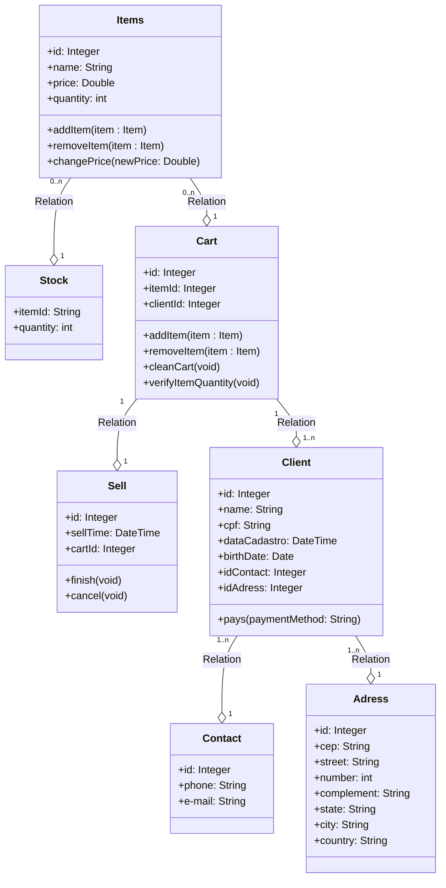

# BackEnd-Java-Controle-de-Loja

```mermaid
classDiagram
  class Items {
    +id: Integer
    +name: String
    +price: Double
    +quantity: int
    +addItem(item : Item)
    +removeItem(item : Item)
    +changePrice(newPrice: Double)
  }
  class Stock {
    +itemId: String
    +quantity: int
  }
  class Cart {
    +id: Integer
    +itemId: Integer
    +clientId: Integer
    +addItem(item : Item)
    +removeItem(item : Item)
    +cleanCart(void)
    +verifyItemQuantity(void)
  }
  class Sell {
    +id: Integer
    +sellTime: DateTime
    +cartId: Integer
    +finish(void)
    +cancel(void)
  }
  class Client {
    +id: Integer
    +name: String
    +cpf: String
    +dataCadastro: DateTime
    +birthDate: Date
    +idContact: Integer
    +idAdress: Integer
    +pays(paymentMethod: String)
  }
  class Contact {
    +id: Integer
    +phone: String
    +e-mail: String
  }
  class Adress {
    +id: Integer
    +cep: String
    +street: String
    +number: int
    +complement: String
    +state: String
    +city: String
    +country: String
  }

  Items "0..n" --o "1" Cart : Relation
  Items "0..n" --o "1" Stock : Relation
  Cart "1" --o "1" Sell : Relation
  Cart "1" --o "1..n" Client : Relation
  Client "1..n" --o "1" Contact : Relation
  Client "1..n" --o "1" Adress : Relation
```
